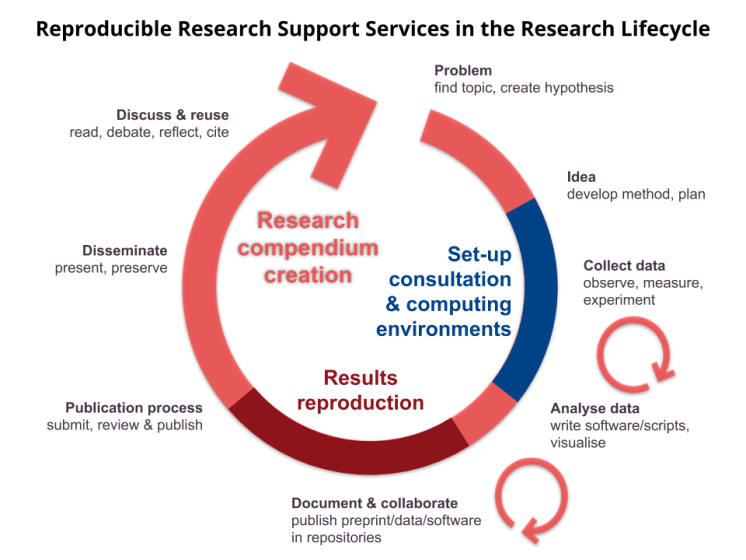

--------

🚨 NOTE: This website is an archive of the temporary R2S2 offered at Unversity of Münster in 2021. The service is **not** offered anymore! 🚨

🚨 This website exists as a resource for people and organisations who want to offer similar services, and to provide the hopefully still useful **[R2S2 Knowledge Base](/r2s2/knowledge-base/)**. 🚨

<!--
Websites now not available anymore:
https://www.uni-muenster.de/Publizieren/
https://go.wwu.de/r2s2

Old news items:
https://www.ulb.uni-muenster.de/bibliothek/aktuell/nachricht/2641
https://www.uni-muenster.de/MediBib/aktuelles/32142
-->

--------

## Reproducible Research Support Service (R2S2)

The University and State Library of Münster (ULB Münster) is one of the core service providers for researchers at the University of Münster (WWU). ULB Münster offers core library services, such as access to literature or publication, but also develops solutions and services to help members of Münster University to conduct their research, such as the service center research data management (Servicecenter Forschungsdatenmanagement, jointly operated with the administration of the University of Münster and WWU IT).

Together with the research project "Opening Reproducible Research" ([o2r](https://o2r.info)), the ULB Münster now offers the novel Reproducible Research Support Service, or R2S2 for short.
During the winter term 2020/21, researchers of all faculties are invited to get in touch with experts in reproducible research to improve the reproducibility of their work, and thereby increase the transparency, understandability, reusability, and hopefully quality of research outputs.
Reproducibility is a pillar of science.
Yet, due to the advancement or technologies, many studies find published papers to be irreproducible due to insufficient/incomplete/disappearing data and code artefacts.
That is why today, likely also in your discipline, a reproducible workflow is a comparative advantage during journal reviews and increases the value of your publication for reuse and citation by others.
In the future, the requirements by journals and conferences for accepting articles can be expected to increase.
R2S2 puts researchers at the University of Münster in a position to create excellent reproducible research.

The following services are offered and described in detail below:

- Results reproduction before submission
- Project set-up consulation and computing environment management
- Research compendium creation

Note that the extent of our services or the prerequisites for consultations may change over the course of the test phase.
Please re-visit this page shortly before you get in touch with us - thanks!

Further please note that the sole focus of R2S2 is computational reproduciblity in the sense of the [Claerbout/Donoho/Peng terminology}(https://arxiv.org/abs/1802.03311).
In other words, [The Turing Way](https://book.the-turing-way.org/reproducible-research/overview/overview-definitions.html) _"define[s] reproducible research as work that can be independently recreated from the same data and the same code that the original team used"_.

## Who can get support?

Any researcher affiliated with the University of Münster, e.g., professors, post-docs, PhD students, or Master students. All faculties and institutes.

Note that for MSc-level research, such as MSc-thesis, we kindly ask you to include your supervisor in the first contact email.

## How to get support?

General contact: ~~o2r.support@uni-muenster.de~~

Please use the general contact email to initiate a consultation.
You may use the following more dynamic but also public communication channels to stay in touch during a consultation or for pre-consultation inquiries.

Chat: You may also start your consultation or send us short questions and updates, which are not sensitive, in the public ~~R2S2 Chat on Mattermost~~.

## What services are offered?

### Results reproduction before submission

You created a computer-based workflow as part of your latest paper submission?
Great!
Now it is time to make sure that your computational steps can be understood and recreated by a third party before you submit the workflow for peer review or publication of a preprint.
Such an independent confirmation increases trust in your work.

During results reproduction, an R2S2 team member will evaluate the data and code provided by you (file organisation, documentation, code understandability, etc.) and follow the provided instructions to execute the workflow.
We will then report on our results, compared to the ones provided by you, and give general feedback on what you may improve to further increase accessibility, understandability, and reusability for third parties.
For more on the general feedback, see "Research compendium creation" below.

**Limitations**

- We will not replicate your study (collect new data, use same analysis/code), make it robust (same data, different code/analysis), or generalise your work (different data, different analysis) (see [The Turing Way's definitions}(https://book.the-turing-way.org/reproducible-research/overview/overview-definitions.html)).
- The reproduction does not cover the content of your paper, such as checking your research methodology, questioning your conclusions/assumptions, or making direct changes to the work.
- To be able to reproduce your workflow, your workflow or scripts must be based on software/programming language that is available to us, ideally free and open source software.
- Exemptions may be made for software available to employees of Münster University or where you can provide access for the R2S2 team member.
- No High-Performance-Computing (HPC) or Big Data: the R2S2 team does not have sufficient resources to reproduce very complex and extensive computations; please do get in touch if you are unsure if your data is "too big" or if you want to make a case why we should consider your workflow.
- Duration of computations should be under 24 hours on a reasonably sized desktop computer - consider creating a synthetic dataset or subset if this is the case; please do get in touch if you are unsure if your computation takes too long or if you want to make a case why we should consider your workflow.
- R2S2 team members are familiar with common programming languages in research/computing (R, Python, Java, JavaScript, Julia, …), but the more specific the language/environment, the better your instructions have to be.
Thanks for your understanding!

### Project set-up consultation and computing environment management

You can make your life and the life of collaborators (e.g., future you or the next PhD student) much easier if you consider reproducibility from the start of a research project.
If there are no experts on computational reproducibility or open science at your lab/institute/working group, we are happy to have a conversation with you about your ideas and plans.
Let's try to look ahead into the future and see how you can not only avoid to shoot yourself in the foot, but be very efficient in your day-to-day work habits and score extra points with reviewers and become a reproducible research leader in your community of practice.

**Limitations**

You already write R/Python packages and know about notebooks, virtual environments, Binder, version pinning, containers, and virtual machines?
Get back to us for a results reproduction!

### Research compendium creation

A research compendium accompanies, enhances, or is itself a scientific publication providing data, code, and documentation of a scientific workflow (cf. [research-compendium.science](https://research-compendium.science) for more literature).
It provides all materials for others to reproduce, re-use and extend a particular dataset or method.
The term has been used in various disciplines to describe the desirable "package" of bits and pieces that make up the real scholarship, for which the article or papers is [the "mere advertising"](https://theconversation.com/how-computers-broke-science-and-what-we-can-do-to-fix-it-49938).

If you want to practice reproducible research and open science based on computers, a research compendium is a great approach to package computer-based methods for yourself and for sharing them with others.
As a result of your consultation, you create an archivable package with all information in one place which is ready to be published in a repository and receive a persistent identifier (e.g., a DOI).

The compendium is created based on your current material.
During the consultation, R2S2 team members will provide suggested code edits to facilitate reproduction and to ensures the transparency and reproducibility of your research, a high ease of access to data and code for others, and independent understandability by others.
A research compendium creation may include:

- research data publication
- research software publication
- computing environment definition and publication
- citable data
- citable software

If your research compendium includes data, software, a containerised computing environment, and the possibility for users to manipulate parts of your workflow, then we would like to explore with you the possibility to create an Executable Research Compendium (ERC).
The ERC is o2r's own concept of the "research article of the future".
You can learn about it in [this publication about ERC](https://doi.org/10.1045/january2017-nuest) and see it in action in [this reader's perspective video](https://www.youtube.com/watch?v=e37bzH4cXF4)).

Even if you decide not to publish/submit the research compendium with the article (if journal policies permit) nor after publication of the article, you have the ability to promptly and confidently provide reproduction materials if reviewers or future readers ask for them.

**Limitations**

- We may take a look at the paper, but only in so far as how it connects to the other building blocks of your compendium - the same limitations of results reproductions (see above) apply. Of course, we will not share anything before your research is published or your explicit confirmation.
- It may be more suitable to deposit research data and research software independently, or additionally, in different repositories - we try to find the best solution for your case together with you.

## R2S2 Lifecycle

_The Reproducible Research Support Service offers three types of consultations which are suitable during different phases of the research lifecycle._
_The creation of a research compendium is always possible. The "Set-up consultation & computing environments" works best if the problem and method are already defined, but data collection and analysis phase are not yet started._
_The "Results reproduction" requires the analysis to be fairly complete and ideally happens during the writing of a paper, or a few weeks ahead of the submission of a manuscript to a journal or preprint server._

## Out of scope

The following topics are out of scope for R2S2. Feel free to inquire on these topics nevertheless, as it is hard to define clear boundaries between aspects of reproducible research, but be prepared to be referred to other resources or contact persons (if we are aware of any):

- Help with statistics/computational models
- Software publications/papers/software journals
- Data journals
- Software licenses
- Software/data in research proposals
- Research data management

_Why get in touch if we say we will not be able to help?_
The R2S2 offerings will evolve during the test phase. We will also try to document the cases where we could not help to be aware of any other unanswered needs within the University of Münster.

## What are the terms and limitations?

Besides the limitations mentioned in the respective services above, R2S2 is largely funded by one work package in a small scale research project.
Therefore, the services are provided "as-is" and without any promises on availability or turnaround time.
We have no idea how much interest exists (that is why we do this pilot in the first place!) and kindly ask for your understanding in the desirable situation of having more requests than we can handle.

Furthermore, we need your help to maximise the lessons learned from the testing phase, so that Münster University and other universities can understand the efforts and benefits of a reproducible research-related service point. If you make use of R2S2's services, you agree to the following points.

1. You participate in short online surveys (< 10 minutes) both before and after your individual consultation. These surveys will capture your needs, preexisting knowledge, and concrete challenges, but also generic metadata such as discipline, target journal, career stage, or how you learned about R2S2. Published survey results will be anonymised.
1. A short summary about the research in question and the provided support will be published on R2S2-related websites (e.g., title, abstract, DOI of article/data/software, type/extent of support) in case there was a successful consultation. Of course a pending publication or sensitive data may delay or even prohibit this. Ideally, your research will eventually be published openly (OA article, open data, open methods/sotware), but that is not a strict requirement.
1. If you feel R2S2 contributed in a relevant manner to your work, you consider to mention of the consulting team member and the service point in the acknowledgements section of your work. We appreciate your consideration!

## Resources

Additional links, relevant literature, and material from lessons learned during previous consultations can be found ~~in the Uni Münster Wiki at https://confluence.uni-muenster.de/display/r2s2/~~ in the **[R2S2 Knowledge Base](/r2s2/knowledge-base/)**.

## About

R2S2 was a joint service by ULB Münster and the DFG-funded research project [Opening Reproducible Research](https://o2r.info).
It is inspired by related very useful services, such as Münster University's Science Writing Support and Academic Editing Service and CISER's [R-squared](https://ciser.cornell.edu/research/results-reproduction-r-squared-service/).
Ultimately, our perspective is that Reproducible Research, just as Open Science, are ephemeral terms that will be replaced by "research" and "science" again once researchers are encouraged to work reproducibly and are rewarded adequately for open and reproducible publications.
